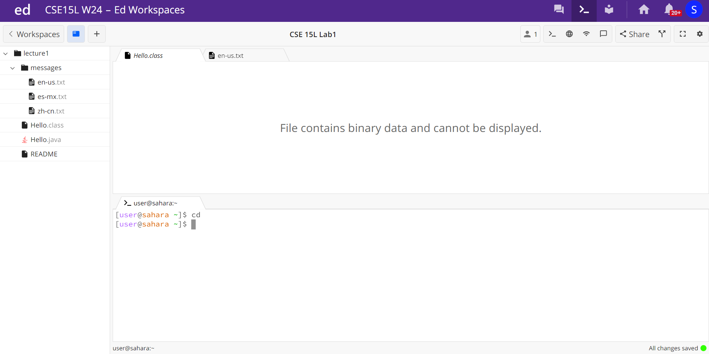
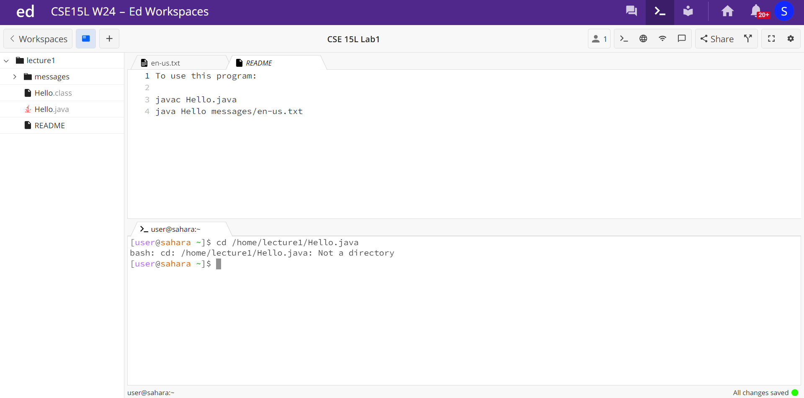
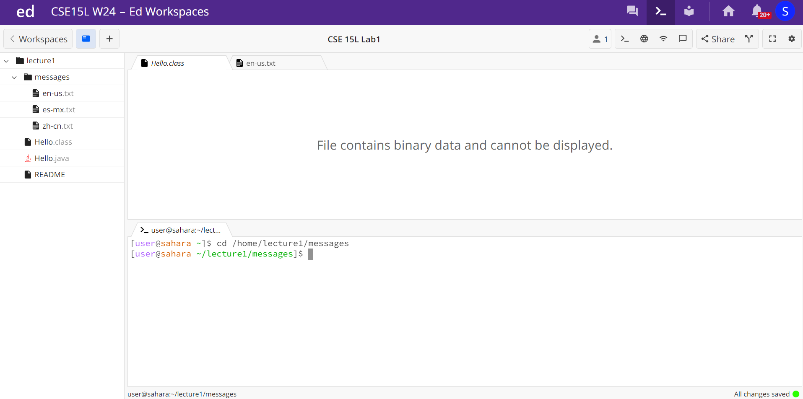
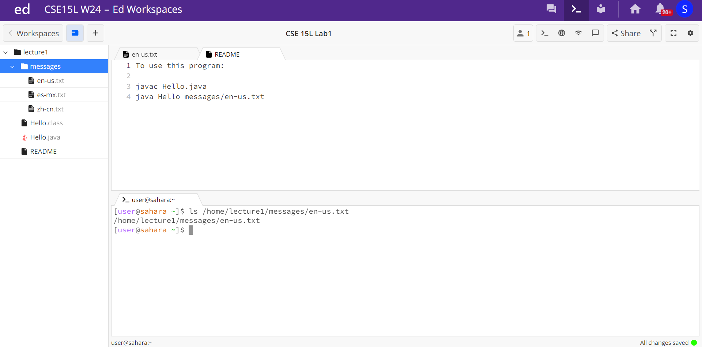
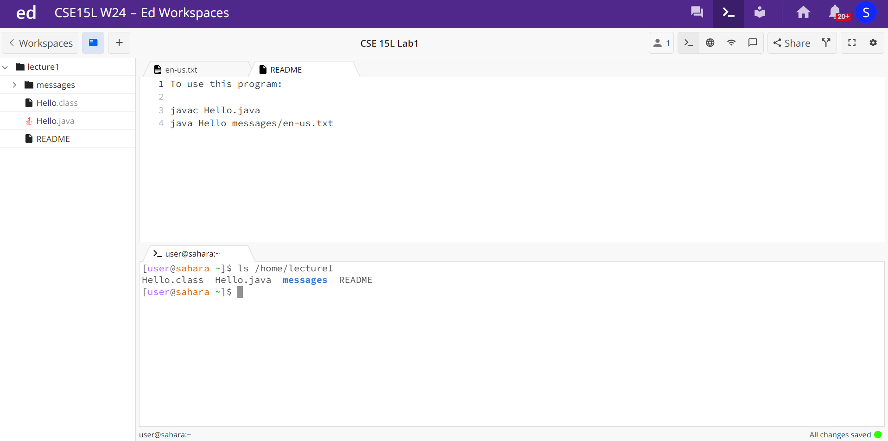
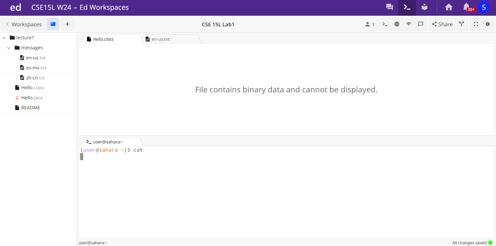
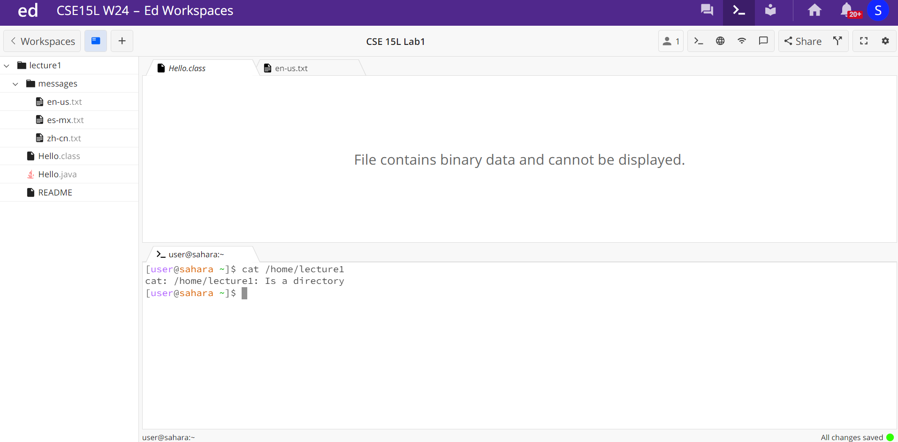
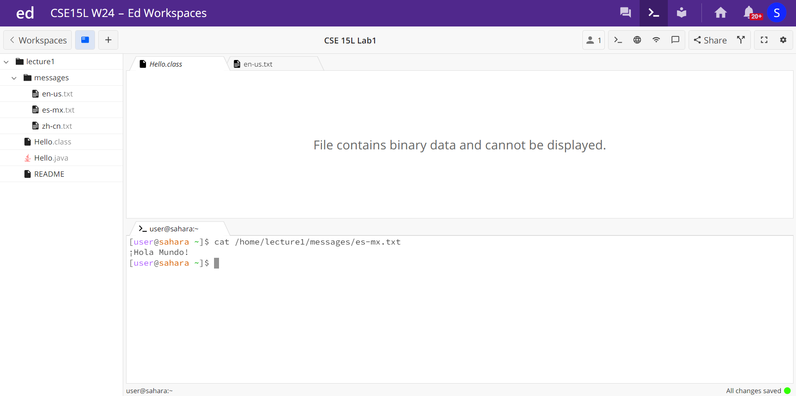

#Lab 1
## Sujit Tunuguntla

** 1) cd command **

*Example of using the cd command with no arguments:*

*Example of using the cd command with a path to a directory as an argument:*

*Example of using the cd command with a path to a file as an argument:*

** 2) ls command **
*Example of using the cd command with no arguments:*

*Example of using the cd command with a path to a directory as an argument:*

*Example of using the cd command with a path to a file as an argument:*

** 3) cat command **
*Example of using the cd command with no arguments:*

*Example of using the cd command with a path to a directory as an argument:*

*Example of using the cd command with a path to a file as an argument:*

