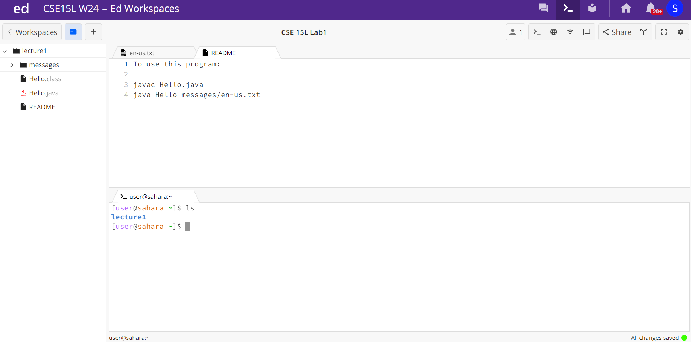

# Lab 1
## Sujit Tunuguntla

**1) cd command**

*Example of using the cd command with no arguments:*

When the cd command is run with no arguments there is no output since the command is used to change directory to the argument.

*Example of using the cd command with a path to a directory as an argument:*

When the cd command is run with a path to a directory, /home/lecture1, the directory is changed to the path given in the argument, lecture1.

*Example of using the cd command with a path to a file as an argument:*

When the cd command is run on a path to a file, /home/lecture1/Hello.java, it throws an error that the argument is not a directory as the command is unable to change the directory since the path given was to a file.

**2) ls command**

*Example of using the cd command with no arguments:*

*Example of using the cd command with a path to a directory as an argument:*

*Example of using the cd command with a path to a file as an argument:*

**3) cat command**

*Example of using the cd command with no arguments:*

*Example of using the cd command with a path to a directory as an argument:*

*Example of using the cd command with a path to a file as an argument:*

