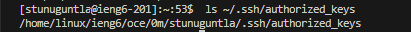
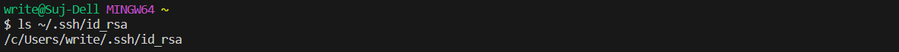
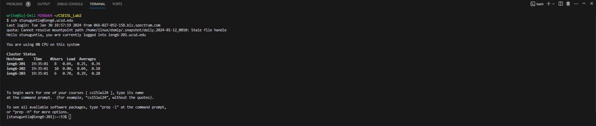

## Lab #2 Servers and SSH Keys ##
# Sujit Tunuguntla #

# **Part 1**
**`ChatServer` code**

    import java.io.IOException;
    import java.net.URI;

    class Handler implements URLHandler {
        String added = "";
        public String handleRequest(URI url) {
            if (url.getPath().equals("/add-message")) {
                String[] parameters = url.getQuery().split("&");
                String message = parameters[0].split("=")[1];
                String user = parameters[1].split("=")[1];
    
                added += user + ": " + message + "\n";
                return added.toString();
            } else {
                return "404 Not Found!";
            }
        }
    }

    public class ChatServer {

        public static void main(String[] args) throws IOException {
        
            if (args.length == 0) {
                System.out.println("Missing port number! Try any number between 1024 to 49151");
                return;
            }
    
            int port = Integer.parseInt(args[0]);
            Server.start(port, new Handler());
        }
    }

*Which methods in your code are called?*

*What are the relevant arguments to those methods, and the values of any relevant fields of the class?*

*How do the values of any relevant fields of the class change from this specific request? If no values got changed, explain why.*

# **Part 2**
*Using `ls` command to get:*

*Absolute path to the private key for SSH key*

*Absolute path to the public key for SSH key*

*Terminal Interaction without password*

# **Part 3**
*Describe something you learned from lab in week 2 or 3 that you didn't know before.*

From the previous labs during week 2 and 3 I learned how to form a remote connection using virtual system of my user stunuguntla@ieng6.ucsd.edu. Using the connection I was able build and run a server from first using `git clone` command on the repository to be able to clone into my local system and setting the directory using `cd` command to wavelet. In week 3 Lab I was able to create a public key that allowed me to bypass without needing to enter a password by creating a unique key and during this time I also learned how new command `scp` and `mkdir` are used. I found out that `scp` command stands for secure copy and allows for securely copying file between servers. The `mkdir` command stands for make directory and is used for create new directories.

