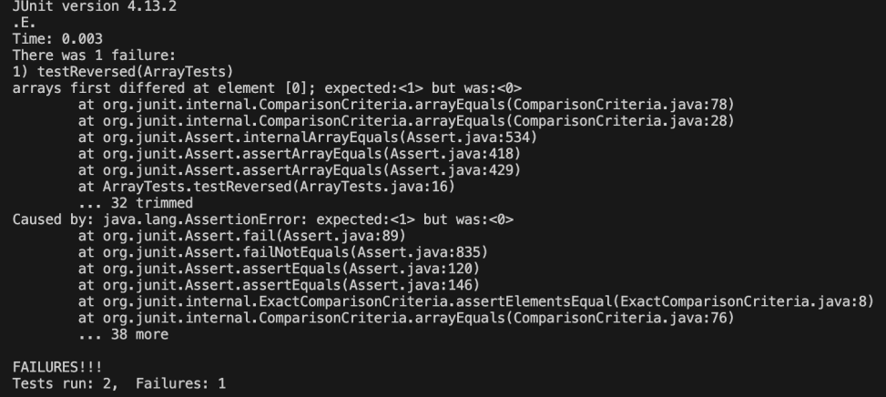

# Lab #3 Bugs and Commands #


## Part 1 - Bugs ##

## A failure-inducing input(bug program) ##
```
    @Test 
	  public void testReversed() {
 
    int[] input1 = { 1, 2, 3 };
    
    ArrayExamples.reverseInPlace(input1);
    
    assertArrayEquals(new int[]{ 3, 2, 1 }, ArrayExamples.reversed(input1));
	  } 
```
## A non failur-inducing input ##
```
   @Test 
	  public void testReversed() {
 
    int[] input1 = { };
    
    assertArrayEquals(new int[]{ }, ArrayExamples.reversed(input1));
	  }
```


## Symptom ##


## Bug Before  Fix ##
```
 static int[] reversed(int[] arr) {
    int[] newArray = new int[arr.length];
    for(int i = 0; i < arr.length; i += 1) {
      arr[i] = newArray[arr.length - i - 1];
    }
    return arr;
  }
```
## Bug After Fix ##
```
static int[] reversed(int[] arr) {
    int[] newArray = new int[arr.length];
    for(int i = 0; i < arr.length; i += 1) {
      newArray[i] = arr[arr.length - i - 1];
    }
    return newArray;
  }
```
## Addressing the issues ##
- Reason: The bug was caused due to there being re-intializing of the elements within the original array to the new array which lead to the old arrays being replaced with values of 0 and the new array therefore having no elements initialized

- Fix: The order was switched with newArray and the original array so that the new array is able to get initialized with the elements of the original array as intended.

## Part 2 - Researching Commands


## `- type ` ##

Example 1:
```
write@Suj-Dell MINGW64 ~/OneDrive/Documents/GitHub/docsearch (main)
$ find technical/biomed/ -type d
technical/biomed/1468-6708-3-1.txt
technical/biomed/1468-6708-3-10.txt
technical/biomed/1468-6708-3-3.txt
technical/biomed/1468-6708-3-4.txt
technical/biomed/1468-6708-3-7.txt
technical/biomed/1471-2091-2-10.txt
technical/biomed/1471-2091-2-11.txt
technical/biomed/1471-2091-2-12.txt
technical/biomed/1471-2091-2-13.txt
technical/biomed/1471-2091-2-16.txt
technical/biomed/1471-2091-2-5.txt
technical/biomed/1471-2091-2-7.txt
technical/biomed/1471-2091-2-9.txt
technical/biomed/1471-2091-3-13.txt
technical/biomed/1471-2091-3-14.txt
technical/biomed/1471-2091-3-15.txt
technical/biomed/1471-2091-3-16.txt
technical/biomed/1471-2091-3-17.txt
technical/biomed/1471-2091-3-18.txt
technical/biomed/1471-2091-3-22.txt
technical/biomed/1471-2091-3-23.txt
technical/biomed/1471-2091-3-30.txt
technical/biomed/1471-2091-3-31.txt
technical/biomed/1471-2091-3-4.txt
technical/biomed/1471-2091-3-8.txt
technical/biomed/1471-2091-4-1.txt
technical/biomed/1471-2091-4-5.txt
technical/biomed/1471-2105-1-1.txt
technical/biomed/1471-2105-2-1.txt
technical/biomed/1471-2105-2-8.txt
technical/biomed/1471-2105-2-9.txt
technical/biomed/1471-2105-3-12.txt
technical/biomed/1471-2105-3-14.txt
technical/biomed/1471-2105-3-16.txt
technical/biomed/1471-2105-3-17.txt
technical/biomed/1471-2105-3-18.txt
technical/biomed/1471-2105-3-2.txt
technical/biomed/1471-2105-3-22.txt
technical/biomed/1471-2105-3-23.txt
technical/biomed/1471-2105-3-24.txt
technical/biomed/1471-2105-3-26.txt
technical/biomed/1471-2105-3-28.txt
technical/biomed/1471-2105-3-3.txt
technical/biomed/1471-2105-3-30.txt
technical/biomed/1471-2105-3-34.txt
technical/biomed/1471-2105-3-37.txt
technical/biomed/1471-2105-3-38.txt
technical/biomed/1471-2105-3-4.txt
technical/biomed/1471-2105-3-6.txt
technical/biomed/1471-2105-4-13.txt
technical/biomed/1471-2105-4-24.txt
technical/biomed/1471-2105-4-25.txt
technical/biomed/1471-2105-4-26.txt
technical/biomed/1471-2105-4-27.txt
technical/biomed/1471-2105-4-28.txt
technical/biomed/1471-2105-4-31.txt
technical/biomed/1471-2121-1-2.txt
technical/biomed/1471-2121-2-1.txt
technical/biomed/1471-2121-2-10.txt
technical/biomed/1471-2121-2-11.txt
technical/biomed/1471-2121-2-12.txt
technical/biomed/1471-2121-2-15.txt
technical/biomed/1471-2121-2-18.txt
technical/biomed/1471-2121-2-21.txt
technical/biomed/1471-2121-2-22.txt
technical/biomed/1471-2121-2-3.txt
technical/biomed/1471-2121-2-6.txt
technical/biomed/1471-2121-3-10.txt
```
* In this example, `-type` d command prints out the names paths of directories contained in a certain directory and is useful to perform operations on directories without affecting the files inside them.

Example 2:
```
write@Suj-Dell MINGW64 ~/OneDrive/Documents/GitHub/docsearch (main)
$ find technical/government/ -type f
technical/government/About_LSC/Comments_on_semiannual.txt
technical/government/About_LSC/commission_report.txt
technical/government/About_LSC/conference_highlights.txt
technical/government/About_LSC/CONFIG_STANDARDS.txt
technical/government/About_LSC/diversity_priorities.txt
technical/government/About_LSC/LegalServCorp_v_VelazquezDissent.txt
technical/government/About_LSC/LegalServCorp_v_VelazquezOpinion.txt
technical/government/About_LSC/LegalServCorp_v_VelazquezSyllabus.txt
technical/government/About_LSC/ODonnell_et_al_v_LSCdecision.txt
technical/government/About_LSC/ONTARIO_LEGAL_AID_SERIES.txt
technical/government/About_LSC/Progress_report.txt
technical/government/About_LSC/Protocol_Regarding_Access.txt
technical/government/About_LSC/reporting_system.txt
technical/government/About_LSC/Special_report_to_congress.txt
technical/government/About_LSC/State_Planning_Report.txt
technical/government/About_LSC/State_Planning_Special_Report.txt
technical/government/About_LSC/Strategic_report.txt
technical/government/Alcohol_Problems/DraftRecom-PDF.txt
technical/government/Alcohol_Problems/Session2-PDF.txt
technical/government/Alcohol_Problems/Session3-PDF.txt
technical/government/Alcohol_Problems/Session4-PDF.txt
technical/government/Env_Prot_Agen/1-3_meth_901.txt
technical/government/Env_Prot_Agen/atx1-6.txt
technical/government/Env_Prot_Agen/bill.txt
technical/government/Env_Prot_Agen/ctf1-6.txt
technical/government/Env_Prot_Agen/ctf7-10.txt
```

* In this example, using the -type f command is used to look and find regular files and can be useful to search for files by name or extension.

## 2) ` -size ` ##
Example 1:
```
write@Suj-Dell MINGW64 ~/OneDrive/Documents/GitHub/docsearch (main)
$ find technical/government/ -size +12k
technical/government/About_LSC/Comments_on_semiannual.txt
technical/government/About_LSC/commission_report.txt
technical/government/About_LSC/conference_highlights.txt
technical/government/About_LSC/CONFIG_STANDARDS.txt
technical/government/About_LSC/diversity_priorities.txt
technical/government/About_LSC/LegalServCorp_v_VelazquezDissent.txt
technical/government/About_LSC/LegalServCorp_v_VelazquezOpinion.txt
technical/government/About_LSC/ONTARIO_LEGAL_AID_SERIES.txt
technical/government/About_LSC/Progress_report.txt
technical/government/About_LSC/Protocol_Regarding_Access.txt
technical/government/About_LSC/reporting_system.txt
technical/government/About_LSC/Special_report_to_congress.txt
technical/government/About_LSC/State_Planning_Report.txt
technical/government/About_LSC/State_Planning_Special_Report.txt
technical/government/About_LSC/Strategic_report.txt
technical/government/Alcohol_Problems/DraftRecom-PDF.txt
technical/government/Alcohol_Problems/Session2-PDF.txt
technical/government/Alcohol_Problems/Session3-PDF.txt
technical/government/Alcohol_Problems/Session4-PDF.txt
technical/government/Env_Prot_Agen/1-3_meth_901.txt
technical/government/Env_Prot_Agen/atx1-6.txt
technical/government/Env_Prot_Agen/bill.txt
technical/government/Env_Prot_Agen/ctf1-6.txt
technical/government/Env_Prot_Agen/ctf7-10.txt
technical/government/Env_Prot_Agen/ctm4-10.txt
technical/government/Env_Prot_Agen/final.txt
technical/government/Env_Prot_Agen/jeffordslieberm.txt
technical/government/Env_Prot_Agen/multi102902.txt
technical/government/Env_Prot_Agen/nov1.txt
technical/government/Env_Prot_Agen/ro_clear_skies_book.txt
technical/government/Env_Prot_Agen/section-by-section_summary.txt
technical/government/Env_Prot_Agen/tech_adden.txt
technical/government/Env_Prot_Agen/tech_sectiong.txt
technical/government/Gen_Account_Office/ai00134.txt
technical/government/Gen_Account_Office/ai2132.txt
```
* In this example the command `-size` +12k is used in combination with the `find` command as this allows there to be filter by using the `-size` to query based on the file sizes and by specifying the +12k, there will be filtered to only files that are greater than 12 kilobytes in size. (Note: the output has been truncated to be within a page as mentioned in previous grading comments)
  
Example 2:
```
write@Suj-Dell MINGW64 ~/OneDrive/Documents/GitHub/docsearch (main)
$ find technical/biomed/ -size -15k
technical/biomed/1468-6708-3-1.txt
technical/biomed/1468-6708-3-10.txt
technical/biomed/1468-6708-3-3.txt
technical/biomed/1468-6708-3-4.txt
technical/biomed/1468-6708-3-7.txt
technical/biomed/1471-2091-2-10.txt
technical/biomed/1471-2091-2-11.txt
technical/biomed/1471-2091-2-12.txt
technical/biomed/1471-2091-2-13.txt
technical/biomed/1471-2091-2-16.txt
technical/biomed/1471-2091-2-5.txt
technical/biomed/1471-2091-2-7.txt
technical/biomed/1471-2091-2-9.txt
technical/biomed/1471-2091-3-13.txt
technical/biomed/1471-2091-3-14.txt
technical/biomed/1471-2091-3-15.txt
technical/biomed/1471-2091-3-16.txt
technical/biomed/1471-2091-3-17.txt
technical/biomed/1471-2091-3-18.txt
technical/biomed/1471-2091-3-22.txt
technical/biomed/1471-2091-3-23.txt
technical/biomed/1471-2091-3-30.txt
technical/biomed/1471-2091-3-31.txt
technical/biomed/1471-2091-3-4.txt
technical/biomed/1471-2091-3-8.txt
technical/biomed/1471-2091-4-1.txt
technical/biomed/1471-2091-4-5.txt
technical/biomed/1471-2105-1-1.txt
technical/biomed/1471-2105-2-1.txt
```

*  In this example the command `-size` -15k is used in combination with the `find` command as this allows there to be filter by using the `-size` to query based on the file sizes and by specifying the -15k, there will be filtered to only files that are smaller than 15 kilobytes in size. (Note: the output has been truncated to be within a page as mentioned in previous grading comments)

## 3) `-mtime` ##

Example 1:
```
write@Suj-Dell MINGW64 ~/OneDrive/Documents/GitHub/docsearch (main)
$ find technical/biomed/ -mtime -7
technical/biomed/
technical/biomed/1468-6708-3-1.txt
technical/biomed/1468-6708-3-10.txt
technical/biomed/1468-6708-3-3.txt
technical/biomed/1468-6708-3-4.txt
technical/biomed/1468-6708-3-7.txt
technical/biomed/1471-2091-2-10.txt
technical/biomed/1471-2091-2-11.txt
technical/biomed/1471-2091-2-12.txt
technical/biomed/1471-2091-2-13.txt
technical/biomed/1471-2091-2-16.txt
technical/biomed/1471-2091-2-5.txt
technical/biomed/1471-2091-2-7.txt
technical/biomed/1471-2091-2-9.txt
technical/biomed/1471-2091-3-13.txt
technical/biomed/1471-2091-3-14.txt
technical/biomed/1471-2091-3-15.txt
technical/biomed/1471-2091-3-16.txt
technical/biomed/1471-2091-3-17.txt
technical/biomed/1471-2091-3-18.txt
technical/biomed/1471-2091-3-22.txt
technical/biomed/1471-2091-3-23.txt
technical/biomed/1471-2091-3-30.txt
technical/biomed/1471-2091-3-31.txt
technical/biomed/1471-2091-3-4.txt
technical/biomed/1471-2091-3-8.txt
technical/biomed/1471-2091-4-1.txt
technical/biomed/1471-2091-4-5.txt
technical/biomed/1471-2105-1-1.txt
technical/biomed/1471-2105-2-1.txt
technical/biomed/1471-2105-2-8.txt
technical/biomed/1471-2105-2-9.txt
technical/biomed/1471-2105-3-12.txt
technical/biomed/1471-2105-3-14.txt
technical/biomed/1471-2105-3-16.txt
technical/biomed/1471-2105-3-17.txt
technical/biomed/1471-2105-3-18.txt
technical/biomed/1471-2105-3-2.txt
technical/biomed/1471-2105-3-22.txt
technical/biomed/1471-2105-3-23.txt
technical/biomed/1471-2105-3-24.txt
technical/biomed/1471-2105-3-26.txt
technical/biomed/1471-2105-3-28.txt
technical/biomed/1471-2105-3-3.txt
technical/biomed/1471-2105-3-30.txt
technical/biomed/1471-2105-3-34.txt
technical/biomed/1471-2105-3-37.txt
technical/biomed/1471-2105-3-38.txt
technical/biomed/1471-2105-3-4.txt
technical/biomed/1471-2105-3-6.txt
technical/biomed/1471-2105-4-13.txt
technical/biomed/1471-2105-4-24.txt
technical/biomed/1471-2105-4-25.txt
technical/biomed/1471-2105-4-26.txt
technical/biomed/1471-2105-4-27.txt
technical/biomed/1471-2105-4-28.txt
technical/biomed/1471-2105-4-31.txt
technical/biomed/1471-2121-1-2.txt
technical/biomed/1471-2121-2-1.txt
technical/biomed/1471-2121-2-10.txt
technical/biomed/1471-2121-2-11.txt
technical/biomed/1471-2121-2-12.txt
technical/biomed/1471-2121-2-15.txt
technical/biomed/1471-2121-2-18.txt
technical/biomed/1471-2121-2-21.txt
technical/biomed/1471-2121-2-22.txt
technical/biomed/1471-2121-2-3.txt
technical/biomed/1471-2121-2-6.txt
technical/biomed/1471-2121-3-10.txt
technical/biomed/1471-2121-3-11.txt
```
* In this example `-mtime` command is used to search combined with the `-find` command for which files were modified in a specific period of time and in this case the -7 following the command indicates for files modified within the last 7 days . 
Example 2:
```
write@Suj-Dell MINGW64 ~/OneDrive/Documents/GitHub/docsearch (main)
$ find technical/plos/ -mtime +3
technical/plos/
technical/plos/journal.pbio.0020001.txt
technical/plos/journal.pbio.0020010.txt
technical/plos/journal.pbio.0020012.txt
technical/plos/journal.pbio.0020013.txt
technical/plos/journal.pbio.0020019.txt
technical/plos/journal.pbio.0020028.txt
technical/plos/journal.pbio.0020035.txt
technical/plos/journal.pbio.0020040.txt
technical/plos/journal.pbio.0020042.txt
technical/plos/journal.pbio.0020043.txt
technical/plos/journal.pbio.0020046.txt
technical/plos/journal.pbio.0020047.txt
technical/plos/journal.pbio.0020052.txt
technical/plos/journal.pbio.0020053.txt
technical/plos/journal.pbio.0020054.txt
technical/plos/journal.pbio.0020063.txt
technical/plos/journal.pbio.0020064.txt
technical/plos/journal.pbio.0020067.txt
technical/plos/journal.pbio.0020068.txt
technical/plos/journal.pbio.0020071.txt
technical/plos/journal.pbio.0020073.txt
technical/plos/journal.pbio.0020100.txt
technical/plos/journal.pbio.0020101.txt
technical/plos/journal.pbio.0020105.txt
technical/plos/journal.pbio.0020112.txt
technical/plos/journal.pbio.0020113.txt
technical/plos/journal.pbio.0020116.txt
technical/plos/journal.pbio.0020121.txt
technical/plos/journal.pbio.0020125.txt
technical/plos/journal.pbio.0020127.txt
technical/plos/journal.pbio.0020133.txt
technical/plos/journal.pbio.0020140.txt
technical/plos/journal.pbio.0020145.txt
```
* In this example `-mtime` command is used to combined with the `-find` command to search for which files were modified in a specific period of time and in this case the +3 following the command indicates for files modified after past the last 3 days. 

## 4) `-perm`
Example 1:
```
write@Suj-Dell MINGW64 ~/OneDrive/Documents/GitHub/docsearch (main)
$ find technical/plos/ -perm 541
technical/plos/journal.pbio.0020001.txt
technical/plos/journal.pbio.0020010.txt
technical/plos/journal.pbio.0020012.txt
technical/plos/journal.pbio.0020013.txt
technical/plos/journal.pbio.0020019.txt
technical/plos/journal.pbio.0020028.txt
technical/plos/journal.pbio.0020035.txt
technical/plos/journal.pbio.0020040.txt
technical/plos/journal.pbio.0020042.txt
technical/plos/journal.pbio.0020043.txt
technical/plos/journal.pbio.0020046.txt
technical/plos/journal.pbio.0020047.txt
technical/plos/journal.pbio.0020052.txt
technical/plos/journal.pbio.0020053.txt
technical/plos/journal.pbio.0020054.txt
technical/plos/journal.pbio.0020063.txt
technical/plos/journal.pbio.0020064.txt
technical/plos/journal.pbio.0020067.txt
technical/plos/journal.pbio.0020068.txt
technical/plos/journal.pbio.0020071.txt
technical/plos/journal.pbio.0020073.txt
technical/plos/journal.pbio.0020100.txt
technical/plos/journal.pbio.0020101.txt
technical/plos/journal.pbio.0020105.txt
technical/plos/journal.pbio.0020112.txt
technical/plos/journal.pbio.0020113.txt
technical/plos/journal.pbio.0020116.txt
technical/plos/journal.pbio.0020121.txt
technical/plos/journal.pbio.0020125.txt
technical/plos/journal.pbio.0020127.txt
technical/plos/journal.pbio.0020133.txt
technical/plos/journal.pbio.0020140.txt
technical/plos/journal.pbio.0020145.txt
technical/plos/journal.pbio.0020146.txt
technical/plos/journal.pbio.0020147.txt
```
* In this example, the `-perm` command is useful to be able to search for files combined with the `-find` command with a specific number of permissions allowed and will be easy to verify file permissions that are unprotected or restrictive and in this case the 641 indicates readable and executable by the owner, but only readable by others
Example 2:
```
write@Suj-Dell MINGW64 ~/OneDrive/Documents/GitHub/docsearch (main)
$ find technical/government/ -perm 644
technical/government/About_LSC/Comments_on_semiannual.txt
technical/government/About_LSC/commission_report.txt
technical/government/About_LSC/conference_highlights.txt
technical/government/About_LSC/CONFIG_STANDARDS.txt
technical/government/About_LSC/diversity_priorities.txt
technical/government/About_LSC/LegalServCorp_v_VelazquezDissent.txt
technical/government/About_LSC/LegalServCorp_v_VelazquezOpinion.txt
technical/government/About_LSC/LegalServCorp_v_VelazquezSyllabus.txt
technical/government/About_LSC/ODonnell_et_al_v_LSCdecision.txt
technical/government/About_LSC/ONTARIO_LEGAL_AID_SERIES.txt
technical/government/About_LSC/Progress_report.txt
technical/government/About_LSC/Protocol_Regarding_Access.txt
technical/government/About_LSC/reporting_system.txt
technical/government/About_LSC/Special_report_to_congress.txt
technical/government/About_LSC/State_Planning_Report.txt
technical/government/About_LSC/State_Planning_Special_Report.txt
technical/government/About_LSC/Strategic_report.txt
technical/government/Alcohol_Problems/DraftRecom-PDF.txt
technical/government/Alcohol_Problems/Session2-PDF.txt
technical/government/Alcohol_Problems/Session3-PDF.txt
technical/government/Alcohol_Problems/Session4-PDF.txt
technical/government/Env_Prot_Agen/1-3_meth_901.txt
technical/government/Env_Prot_Agen/atx1-6.txt
technical/government/Env_Prot_Agen/bill.txt
technical/government/Env_Prot_Agen/ctf1-6.txt
technical/government/Env_Prot_Agen/ctf7-10.txt
technical/government/Env_Prot_Agen/ctm4-10.txt
technical/government/Env_Prot_Agen/final.txt
technical/government/Env_Prot_Agen/jeffordslieberm.txt
technical/government/Env_Prot_Agen/multi102902.txt
technical/government/Env_Prot_Agen/nov1.txt
technical/government/Env_Prot_Agen/ro_clear_skies_book.txt
technical/government/Env_Prot_Agen/section-by-section_summary.txt
technical/government/Env_Prot_Agen/tech_adden.txt
technical/government/Env_Prot_Agen/tech_sectiong.txt
technical/government/Gen_Account_Office/ai00134.txt
```

* In this example, the `-perm` command is useful to be able to search for files combined with the `-find` command with a specific number of permissions allowed and will be easy to verify file permissions that are unprotected or restrictive and in this case the 644 indicates readable and writable by the owner, but only readable by others* 

 
## Sources ##
https://www.geeksforgeeks.org/find-command-in-linux-with-examples/


https://man7.org/linux/man-pages/man1/find.1.html
