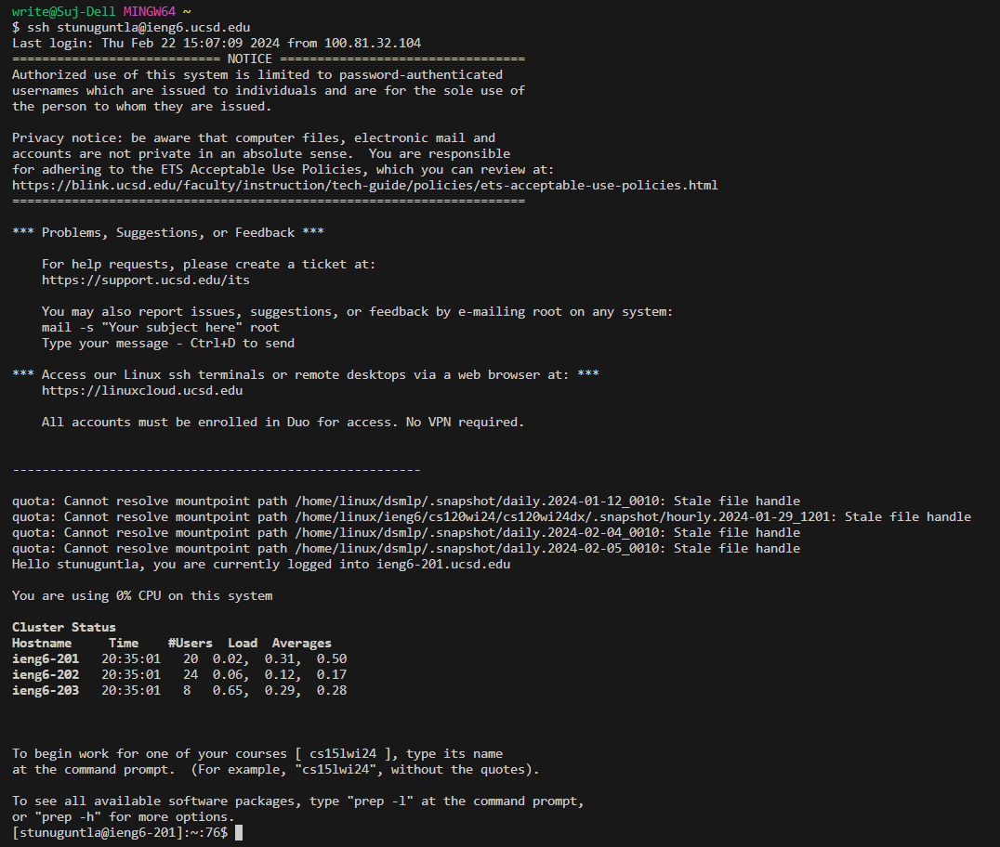
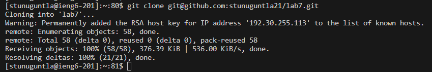
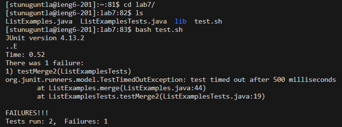
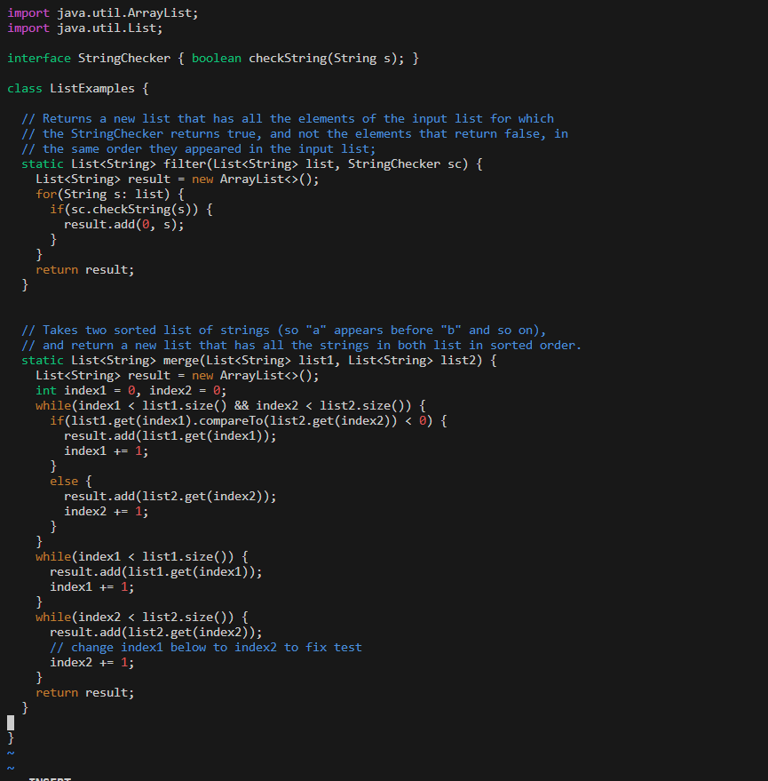
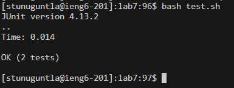
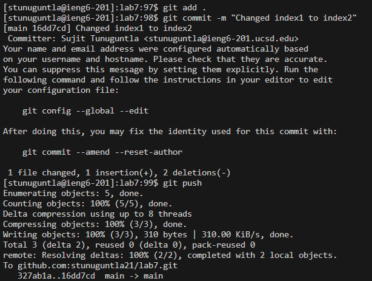

# Lab Report #4 Vim #

## Step #1 Log into ieng6 ##

Keys Pressed:
`s` `s` `h` `<space>` `s` `t` `u` `n` `u` `g` `u` `n` `t` `l` `a` `@` `i` `e` `n` `g` `6` `.` `u` `c` `s` `d` `.` `e` `d` `u` `<enter>` 

Explanation: the `ssh` command allows for the login into a specified server which in this case is ieng6 with the previously set up private key

## Step #2 Clone your fork of the repository from your Github account (using the SSH URL)

Keys pressed:
`g` `i` `t` `<space>` `c` `l` `o` `n` `e` `<space>` `<CTRL-V>` `<enter>` 

Explanation: Using the ssh url copied from Github to paste it into the terminal, the git clone
command is used to clone my fork of the lab7 repository on github into my virtual machine.

## Step #3 Run the tests to show failure

Keys pressed:
`c` `d` `l` `<tab>` `<enter>`
`l` `s` `<enter>`
`b` `a` `s` `h` `<space>`  `t` `<tab>` `<enter>`

Explanation:
Used `cd` in order to change the current directory to lab 7
Used `ls` in order to see the files in this directory
Used the `bash` command to run a bash script in order to run the test

## Step #4 Fixing Failed Test

Keys Pressed:
`v` `i` `m` `<space>` `i` `<tab>` `.` `<tab>` `<enter>`
`<up>` `<up>` `<up>` `<up>` `<up>` `<up>` `w` `w` `<left>`
`i`
`<delete>` `<2>` 
`<esc>`
`:` `w` `q` `<enter>` 

Explanation: 
* Used the `vim` command in to open desired file which was ListExample.java for editing through `vim` and tab key to complete the file name
* Navigated the file contents in the terminal to the line causing the error, needed to use w to move the cursor to the first character of the next word and up arrow for navigation as the file opened begin from the last line of the file.
* By using the key 'i' was able to go into editing mode
* Deleted the 1 and replaced it with 2 to fix the error
* Used 'esc' to exit from the editing mode
* To save the changes to file typed `:` `w` `q` `<enter>` into the terminal

## Step #5 : Run the tests for success

Keys Pressed:
`<up>` `<up >` `<enter>` 

Explanation:
Pressed the up arrow key twice as the `bash test.sh` was previously run two commands earlier in the search history so by clicking the up arrows was able to access it

## Step #6 : Commit and push the resulting change to your Github account

Keys Pressed:
`g` `i` `t` `<space>` `a` `d` `d` `<space>` `.` `<enter>` 

Explanation:
The `git add .` command stages all changes in the current directory to be ready to be included in the next git commit

Keys Pressed:
`g` `i` `t` `<space>` `c` `o` `m` `m` `i` `t` `<space>` `"` `C` `h` `a` `n` `g` `e` `d` `<space>` `i` `n` `d` `e` `x` `1` `<space>` `t` `o` `<space>` `i` `n` `d` `e` `x` `2` `"` `<enter>` 

Explanation: 
The `git commit` command creates a new commit containing the currently staged changes and byadding `-m` followed by quotation marks this allows for there to be a message inputted by the user with the commit.

Keys Pressed:
`g` `i` `t` `<space>` `p` `u` `s` `h` `<enter>` 

Explanation:
The `git push` command allows for there to be commit from the local repository in the server to into a remote repository.

