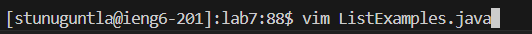

# Lab Report #4 Vim #

## Step #1 Log into ieng6 ##

Keys Pressed:
`s` `s` `h` `<space>` `s` `t` u n u g u n t l a @ i e n g 6 . u c s d . e d u <enter> 

Explanation: the ssh command lets me login into a specified server which in this case is ieng6

## Step #2 Clone your fork of the repository from your Github account (using the SSH URL)

Keys pressed:
g i t <space> c l o n e <space> <CTRL-V> <enter> 

Explanation: Using the ssh url copied from Github to paste it into the terminal, the git clone
command is used to clone my fork of the lab7 repository on github into my virtual machine.

## Step #3 Run the tests to show failure

Keys pressed:
c d l <tab> <enter>
l s <enter>
b a s h <space> t <tab> <enter>
Explanation:
Used cd in order to change the current directory to lab 7
Used ls in order to see the files in this directory
Used the bash command to run a bash script in order to run the test

## Step #4 Fixing Failed Test

Keys Pressed:
v i m <space> L i <tab> . <tab> <enter>
<up> <up> <up> <up> <up> <up> w w <left>
i
<delete> <2> 
<esc>
: w q <enter> 
Explanation: 

## Step #5 : Run the tests for success

Keys Pressed:
`<up>` `<up >` `<enter>` 

Explanation:
I pressed the up arrow key twice as the `bash test.sh` was 2 up
in the search history so I used the up arrow keys to access it

## Step #6 : Commit and push the resulting change to your Github account

Keys pressed:
g i t <space> a d d <space> . <enter> 
Explanation:
The git add . command stages all changes in the current directory to be included in the next git commit

Keys pressed:
g i t <space> c o m m i t <space> " C h a n g e d <space> i n d e x 1 <space> t o <space> i n d e x 2 " <enter> 
Explanation: the git commit command creates a new commit containing the currently staged changes, by adding -m followed by quotation marks I can type of a message associated with the commit.

Keys pressed:
g i t <space> p u s h <enter> 
Explanation:
The git push command allows me to commit from my local repository (in this case within the server) into a remote repository

