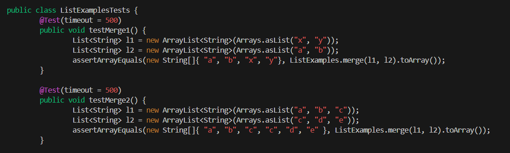
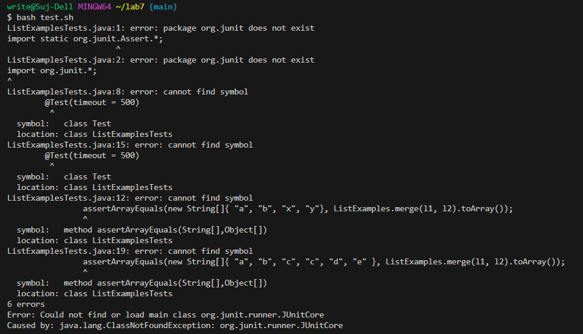
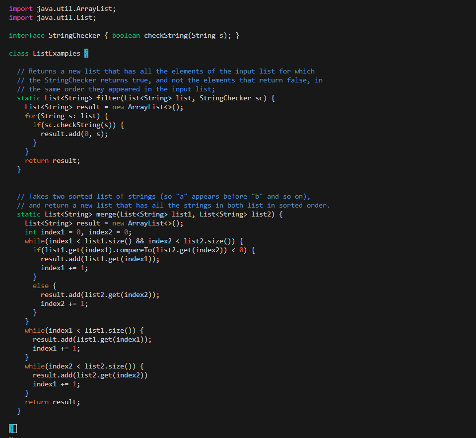
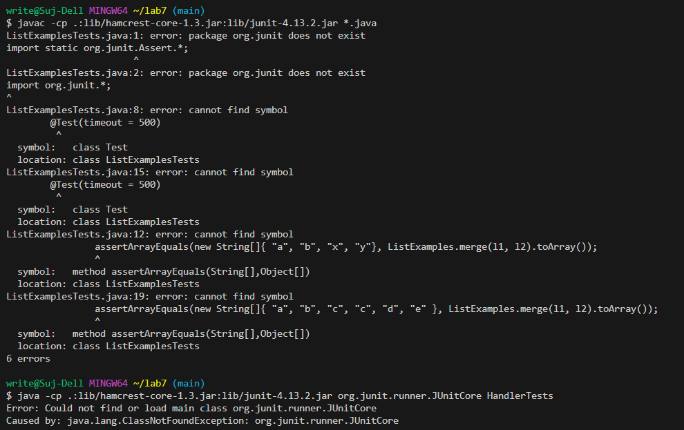

# CSE 15L Lab Report #5 Putting it All Together

## Part 1 - Debugging Scenario ##
**Student:** Hello I am look to get assistance regarding a bug I am facing in my ListExamples.java file as when I run the `bash test.sh` command, my tests keep failing. I assume that the error results from the while loops that have been implemented but can not figure out where it stems from. For assistance with what I am facing I have attached a screenshot of the terminal output message when I ran the tests and observed failing.



**TA:** Hi, thank you for reaching out for assistance. Based on the information provided it looks like the error is from having the test timing out due to the loop being run infinite times based on the way it is being incremented. From the terminal output it looks like the problem starts from line 43 of the `ListExamples.java` file. If you look closely into your file you may notice that an index is being incremented twice as part of the while loop and can ask yourself what is casuign the line to fail due to this and how it can be fixed to prevent the infinite loop? Please reach out again or visit us at office hours if you need more help.

**Student:** Thank you so much for your quickly timely response, what I realized is that when I was incrementing `index1` instead of `index2` that it was updated at both spots of the while loop causing it to run infinite times. I was able to fix it by incrementing `index2` now and have attached the terminal outputr from running the `bash test.sh` with the fixed code.

**File Directory Structure:**
```
lab7
  lib
    hamcrest-core-1.3.jar
    junit-4.13.2.jar
  .gitignore
  ListExamples.java
  ListExamplesTests.java
  test.sh
```

**File Contents Before Fixing File:**

**Full Command to trigger bug in bash test.sh**

**Description of Edit to fix bug:** Edited line 43 in `vim` of `ListExamples.java` from index1+=1 to index2+=1 to prevent there from being an infinite loop.

## Part 2 - Reflection ## 
During my time taking CSE 15L within the second half of the quarter I learned is being able to debug using the java debugger(jdb). With this class being only the second computer science class I have ever taken following CSE11 I am able to understand how the errors resulting from code failures can be debugged rather than going through the length of the code and testing within to see possible failure points using print statements within the code to figure out where the error started from. By learning about jdb in class I was able to incorporate this aspect to be able to debug in a process that is more effecient. Within this new process I can use the jdb command to identify where the fault happens within the code without using print statements.

